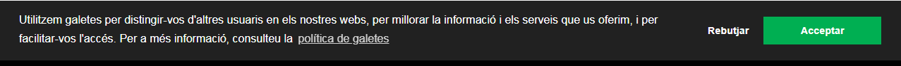
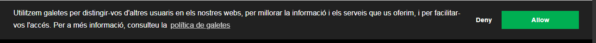
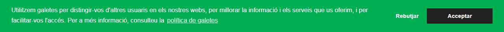
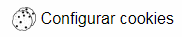

# ICGC-Cookie-GDPR

A small cookie consent banner that complies with the EU GDPR.

This library presents the user with a small banner that shows two buttons to comply with the EU GDPR law. 

---
If the user _allows_ the use of cookies, **a cookie is set to remember the selected option and enables the tracking by Google Analytics**. If the user _denies_ the use of cookies, **the option is stored and Google Analytics trackers are disabled**. A _configure cookies_ button is shown whenever any option is chosen so the user can change his mind
---

## Using the banner on your website
### Get the required files
* Copy the files found in the _dist_ folder to your project and use it in your html


```html
<link rel="stylesheet" href="./dist/cookies-icgc.min.css">
<script src="./dist/cookies-icgc.js"></script>
```

* or use the github stored files to always use the last version
```html
<link rel="stylesheet" href="https://raw.githubusercontent.com/gencat/ICGC-Cookie-GDPR/master/dist/cookies-icgc.min.css">
<script src="https://raw.githubusercontent.com/gencat/ICGC-Cookie-GDPR/master/dist/cookies-icgc.js"></script>
```

### Create the cookie manager object in a script
```html
<script>
		const cuqui = new icgc.CookiesICGC("yourdomain.com", 	["your-google-analytics-id", "another-google-analytics-id"], {configBtnSelector: "#config-button-selector"});
		cuqui.setCookiesEnabledHandler(() => { console.log("Cookies enabled")});
		cuqui.setCookiesDisabledHandler(() => { console.log("Cookies disabled")});
</script>
```
Where:

* The first parameter should be the domain where the cookies are stored
* The second one is a list of Google Analytics Tracking IDs that will be enabled/disabled if the user allows/disallows it. **Note:** This library just manages already present Google Analytics trackers, it does **NOT** add or remove trackers.
* The third one is an options parameter that's used to configure the popup. You can find the list of possible parameters [here](https://raw.githubusercontent.com/gencat/ICGC-Cookie-GDPR/master/src/defaultOptions.js) but the most important ones are the following ones:

|Element|Subelement|Description|
|---|---|---|
|cookie|name|This is the name of the cookie that will be set to save the user preferences|
|content|message|The text used by the popup|
||allow|The text used in the Allow button|
||deny|The text used in the Deny button|
||configButton|The text used in the configuration button that will be shown when the user has choosen some option|
||href|The URL where the user will be directed when the privacy policy link is pressed|
|configBtnSelector||A div element selector **already existing on your HTML** where the configure cookies button will be shown. If this parameter is not set, a div with class _config-popup_ will be created. If it's set to a non existing div, one is created in the body|
* The _setCookiesEnabledHandler_ function is used to set a callback that will be run when the user has enabled the cookies by pressing the **Allow** button
* The _setCookiesDisabledHandler_ function is used to set a callback that will be run when the user has disabled the cookies by pressing the **Deny** button

#### Examples
These examples work on the following HTML
```html
<!DOCTYPE html>
<html lang="en">
<head>
	<meta charset="UTF-8">
	<meta name="viewport" content="width=device-width, initial-scale=1.0">
	<meta http-equiv="X-UA-Compatible" content="ie=edge">
	<title>Document</title>
	<link rel="stylesheet" href="./dist/cookies-icgc.min.css">
</head>
<body>
	<div id="control"></div>
	<script src="./dist/cookies-icgc.js"></script>
</body>
</html>
```

```html
<script>
	new icgc.CookiesICGC("instamaps.cat", [], {configBtnSelector: "#control"});
</script>
```

Shows the default popup, sets a cookie on the _instamaps.cat_ domain and doesn't manage any Google Analytics tracker.


```html
<script>
	new icgc.CookiesICGC("instamaps.cat", ["UA-12345678-1"], {configBtnSelector: "#control"});
</script>
```

Shows the default popup, sets a cookie on the _instamaps.cat_ domain, manages a Google Analytics tracker and shows the configure button in the div with id _control_.

```html
<script>
	new icgc.CookiesICGC("instamaps.cat", ["UA-12345678-1"], {
		configBtnSelector: "#control", 
		content: { 
			allow: "Allow", 
			deny: "Deny"
		}
	});
</script>
```

Shows the default popup, sets a cookie on the _instamaps.cat_ domain, manages a Google Analytics tracker, shows the configure button in the div with id _control_ and changes the button labels to *Allow* and *Deny*

```html
<script>
	new icgc.CookiesICGC("instamaps.cat", ["UA-12345678-1"], {
		configBtnSelector: "#control", 
		palette:{
			popup: {background: "#00b050"}, 
			button: {background: "#222222"},
		}
	});
</script>
```

Shows the default popup, sets a cookie on the _instamaps.cat_ domain, manages a Google Analytics tracker, shows the configure button in the div with id _control_ and changes the button colors

```html
<script>
	const cuqui = new icgc.CookiesICGC("127.0.0.1", ["UA-12345678-1"], {
		configBtnSelector: "#control"
	} );
	cuqui.setCookiesEnabledHandler(() => { console.log("Cookies enabled")});
	cuqui.setCookiesDisabledHandler(() => { console.log("Cookies disabled")});
</script>
```

Shows the default popup, sets a cookie on the _instamaps.cat_ domain, manages a Google Analytics tracker, shows the configure button in the div with id _control_ and changes the button colors

```html
<script>
	const cuqui = new icgc.CookiesICGC("127.0.0.1", ["UA-12345678-1"]);
	cuqui.setCookiesEnabledHandler(() => { console.log("Cookies enabled")});
	cuqui.setCookiesDisabledHandler(() => { console.log("Cookies disabled")});
</script>
```

Shows the default popup, sets a cookie on the _instamaps.cat_ domain, manages a Google Analytics tracker and the default configure button popup

## Building and testing the library

Install the dependencies
```
npm install
```

Building the library
```
npm run build-dev
```
Testing the library
```
npm run lint
npm run test-unit
```
Building to release
```
npm run build-min
```

To see an extensive list of the available scripts you can take a look [here](https://github.com/geostarters/js-project-template#provided-scripts)

## Acknowledgements
This cookie consent banner is heavily based on the [Insites cookieconsent](https://github.com/insites/cookieconsent) work and has been adapted to meet the requirements of the ICGC

## License
This library is provided under the [MIT licence](http://opensource.org/licenses/MIT)


